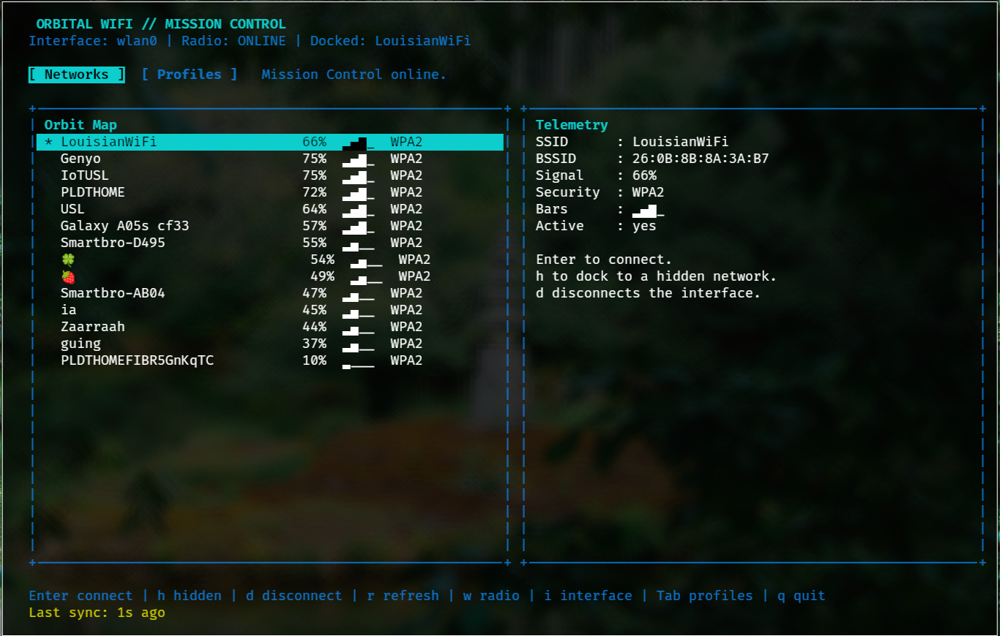

# Orbital WiFi

`orbital-wifi` is a NASA-themed WiFi TUI for Linux. It uses NetworkManager through `nmcli` and is meant to be a practical daily-driver alternative to tools like `wifitui`.

## Screenshot

  

## Features

- Scan nearby WiFi networks
- Connect to open, secured, or hidden networks
- View and reuse saved WiFi profiles
- Delete saved WiFi profiles
- Toggle WiFi radio, disconnect, and switch interfaces
- No runtime dependencies beyond Python and NetworkManager

## Requirements

- Linux
- Python 3.11+
- NetworkManager
- `nmcli` available on `PATH`
- A terminal with curses support

Check that `nmcli` is available:

```bash
nmcli --version
```

## Install

### Install with `pipx`

From the project directory:

```bash
pipx install .
```

After that, run:

```bash
orbital-wifi
```

### Install with `pip`

```bash
python3 -m venv .venv
source .venv/bin/activate
pip install .
```

Then run:

```bash
orbital-wifi
```

### Run without installing

From the project directory:

```bash
PYTHONPATH=src python3 -m orbital_wifi
```

## Uninstall

If you installed with `pipx`:

```bash
pipx uninstall orbital-wifi
```

If you installed with `pip` in a virtual environment:

```bash
source .venv/bin/activate
pip uninstall orbital-wifi
deactivate
```

If you only ran it from source without installing, there is nothing to uninstall.

## Usage

Start the app:

```bash
orbital-wifi
```

Use a specific wireless interface:

```bash
orbital-wifi --interface wlan0
```

Inside the TUI:

- `Up` / `Down`: move selection
- `Enter`: connect to a network or activate a saved profile
- `Tab`: switch between networks and saved profiles
- `h`: connect to a hidden network
- `d`: disconnect the current wireless interface
- `x`: delete the selected saved profile
- `r`: refresh scan results
- `w`: toggle WiFi radio
- `i`: cycle wireless interfaces
- `q`: quit

## Build

Build release artifacts locally with:

```bash
python3 -m build
```

## Arch Linux / AUR

AUR packaging files are included in `packaging/aur/`.

They still need the final release tarball checksum before submission.

## License

MIT
